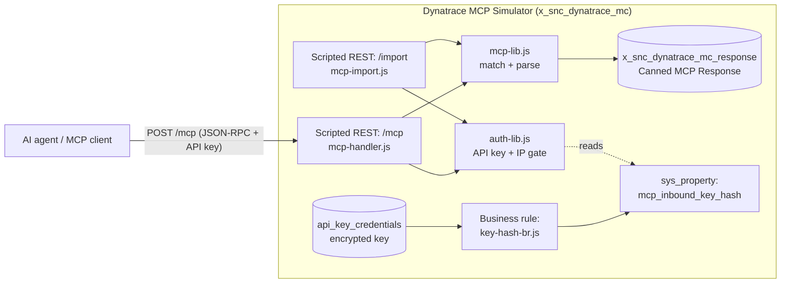
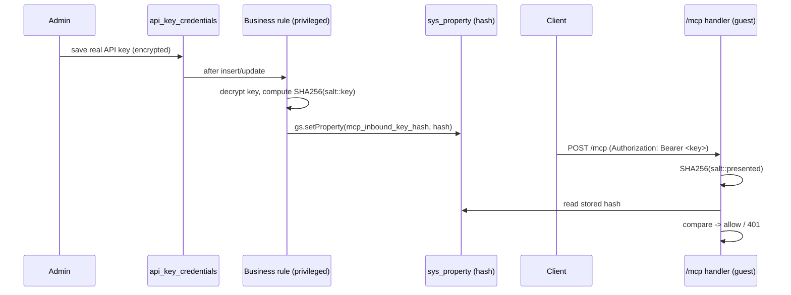
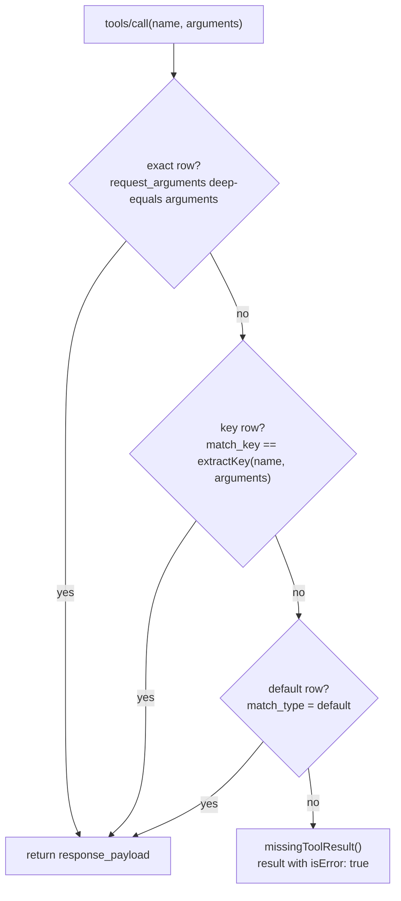

# Dynatrace MCP Simulator

A ServiceNow scoped application that **emulates the Dynatrace MCP server** inside
the platform, to support demos. It exposes a REST endpoint that speaks the Model
Context Protocol (MCP) so AI agents expecting to talk to a real Dynatrace tenant
can call it unchanged. The responses it returns are **canned**, stored in an
editable table, so you can tailor exactly what the "tenant" says for a given demo
without touching code.

- **Scope:** `x_snc_dynatrace_mc`
- **Fluent SDK:** 4.13.6
- **Server identity returned:** `{ "name": "dynatrace-mcp", "version": "1.0" }`

---

## Table of contents

1. [Architecture](#architecture)
2. [Endpoints](#endpoints)
3. [Authentication & source restriction](#authentication--source-restriction)
4. [Supported MCP methods & current toolset](#supported-mcp-methods--current-toolset)
5. [The Canned MCP Response table](#the-canned-mcp-response-table)
6. [Response-matching logic](#response-matching-logic)
7. [Canned response data format](#canned-response-data-format)
8. [Loading data](#loading-data)
9. [Setup / operations runbook](#setup--operations-runbook)
10. [Observability](#observability)
11. [Project layout](#project-layout)
12. [Limitations](#limitations)

---

## Architecture



- **The endpoint runs as the unauthenticated guest user** (routes are public at
  the platform level). It gates itself in-script with an API key and an optional
  IP allow list.
- **Responses come from a table**, not from code. The handler maps an inbound MCP
  call to a row and returns that row's stored JSON-RPC `result`.
- **A capture file** (the real traffic recorded from an actual Dynatrace MCP
  server) can be imported to populate the table.

---

## Endpoints

Base path: `/api/x_snc_dynatrace_mc/dynatrace_mcp`

| Method & path | Purpose | Platform auth | In-script gate |
|---|---|---|---|
| `POST /mcp` | MCP JSON-RPC (Streamable HTTP) endpoint: `initialize`, `notifications/*`, `tools/list`, `tools/call`, `ping` | **public** (`authentication/authorization/internalRole = false`) | API key + optional IP allow list |
| `POST /import` | Load a capture file (e.g. `mcp-rronly.json`) into the Canned MCP Response table | **public** | API key + optional IP allow list |

Full URL example:

```
https://<instance>.service-now.com/api/x_snc_dynatrace_mc/dynatrace_mcp/mcp
```

### `POST /mcp` behavior

- **Body** is a single JSON-RPC 2.0 message **or** a batch array.
- **Notifications** (messages with no `id`, e.g. `notifications/initialized`) →
  HTTP `202`, no body.
- **`initialize`** → returns `serverInfo` + `capabilities`, echoes the client's
  requested `protocolVersion`, and sets an `Mcp-Session-Id` response header
  (preserved from the request header if the client sent one).
- **`tools/call`** → looks up the matching canned row and returns its payload as
  the JSON-RPC `result`. If nothing matches, returns a valid MCP result with
  `isError: true` (so clients fail cleanly rather than seeing a protocol error).
- **Empty body** → `202`. **Malformed JSON** → `400` with JSON-RPC parse error.

### `POST /import` behavior

Returns a summary: `{ success, exchanges, created, updated, skipped, tools_advertised }`.
After loading, it regenerates the `tools/list` row from the imported tool calls.

---

## Authentication & source restriction

This is a true external-MCP emulation: **there is no ServiceNow login.** The REST
routes are public at the platform level, so the handler executes as the
unauthenticated **guest** user and must authenticate the caller itself.

### Gate order (every request, both routes)

1. **IP allow list** → if it fails, HTTP `403`, JSON-RPC code `-32003`.
2. **API key** → if it fails, HTTP `401`, JSON-RPC code `-32001`, header
   `WWW-Authenticate: Bearer realm="dynatrace-mcp"`.

### API key — the "privileged hash-sync" pattern

Because a guest cannot decrypt a Connections & Credentials secret or call `sn_cc`
at request time, the key is **never decrypted in the request path**:



- **Credential:** `api_key_credentials` record *"Dynatrace MCP Simulator inbound
  API key"*, shipped with a non-functional placeholder (`REPLACE_WITH_REAL_KEY`).
- **Business rule** (`key-hash-br.js`): `after insert/update`, filtered on the
  record's own `$id` (survives re-scope/reinstall). Resolves the key with a
  3-tier fallback (`sn_cc` provider → `getDecryptedValue()` → raw value),
  computes the salted SHA-256, and writes it to the property. Empty/placeholder →
  writes an empty hash (endpoint **locked**, rejects everything).
- **Property** `x_snc_dynatrace_mc.mcp_inbound_key_hash`: runtime-created,
  **not** Fluent-managed (a `Property()` record would be write-protected and block
  the rule's `gs.setProperty()`).
- **Salt:** `x_snc_dynatrace_mc::mcp-inbound::v1`. SHA-256 is pure JS so it runs
  identically in the privileged rule and the guest handler. The algorithm/salt
  exist in two places — `src/server/auth-lib.js` (canonical) and inlined in
  `src/server/key-hash-br.js` (because a `Now.include` script can't resolve
  imports). **Change one, change both.**
- **Cross-scope privileges** (declared in Fluent, used only by the rule):
  `ScriptableStandardCredentialsProvider.getCredentialByID` and
  `ScriptableStandardCredential.getAttribute`.

**Accepted key headers** (first match wins):

1. `Authorization: Bearer <key>`
2. `Authorization: <key>`
3. `X-API-Key: <key>`

### IP allow list (optional, defense-in-depth)

- Property `x_snc_dynatrace_mc.mcp_allowed_ips`: comma-separated list of exact
  IPv4, IPv4 CIDR (`198.51.100.0/24`), or exact IPv6 entries.
- **Empty ⇒ feature disabled, allow all** (the API key still gates). This is the
  safe default.
- **Populated ⇒** the client IP must match an entry or it is `403`'d; **fail
  closed** if the client IP can't be determined.
- **Client IP** is resolved from `gs.getSession().getClientIP()` (resolved by the
  platform at the trusted edge), falling back to `X-Forwarded-For` →
  `X-Real-IP`.

> ⚠️ The IP list is **defense-in-depth, not a hard boundary** — for proxied HTTP
> the value ultimately derives from forwarding metadata. Keep the **API key as the
> primary gate**. For a true network boundary use the platform's IP Address Access
> Control (High Security Settings) or an edge WAF.

---

## Supported MCP methods & current toolset

### Protocol methods

| Method | Handled by | Notes |
|---|---|---|
| `initialize` | `buildInitializeResult` | Returns `serverInfo`/`capabilities`; echoes client `protocolVersion`; issues `Mcp-Session-Id`. |
| `notifications/*` | handler | Acked with `202`, no body. |
| `tools/list` | `buildToolsListResult` | Uses a canned `tools/list` row if present; otherwise synthesizes the list from the distinct `tools/call` rows. |
| `tools/call` | `findToolResult` | Looks up the canned row (see matching logic). |
| `ping` | handler | Returns `{}`. |

### Tools (seeded from `mcp-rronly.json`)

The toolset is **data-driven** — any tool present in the table is advertised and
answerable. The shipped seed data covers:

| Tool | Argument | What it simulates |
|---|---|---|
| `get-problem-by-id` | `problemId` (e.g. `P-261013`) | A Davis problem record (`structuredContent.records[...]`). |
| `execute-dql` | `dqlQueryString` | Grail DQL results for service-entity, spans, and logs queries. |

To add or change tools, add/edit rows in the table or import a capture that
contains them — no code change required.

---

## The Canned MCP Response table

**`x_snc_dynatrace_mc_response`** (label: *Canned MCP Response*). One row per
canned interaction.

| Column | Type | Purpose |
|---|---|---|
| `name` | String (mandatory) | Human-readable label. |
| `method` | Choice: `initialize`, `tools/list`, `tools/call`, `ping` | Which MCP method this row answers. Default `tools/call`. |
| `tool_name` | String | For `tools/call`: the MCP tool name (e.g. `get-problem-by-id`). |
| `match_type` | Choice: `exact`, `key`, `default` | How an inbound call is matched to this row. Default `key`. |
| `match_key` | String (4000) | The normalized key compared against the inbound call (see below). |
| `request_arguments` | Multiline JSON | The tool-call arguments. Used for `exact` matching; informational otherwise. |
| `response_payload` | Multiline JSON (mandatory) | **The MCP `result` object returned to the client.** Edit this to change the demo output. |
| `sequence` | Integer | Evaluation order within a match tier (default `100`). |
| `active` | Boolean | Only active rows are considered. Default `true`. |
| `notes` | Multiline text | Free-form notes / provenance. |

List view: `x_snc_dynatrace_mc_response_list.do`

---

## Response-matching logic

For a `tools/call`, the handler reads the **active** rows for that `tool_name`
ordered by `sequence`, then applies three tiers in order (first hit wins):



### Match key derivation (`extractKey`)

The key is derived from the arguments, in this priority:

| Argument present | Key format | Normalization |
|---|---|---|
| `dqlQueryString` | `dql:<query>` | all whitespace collapsed to single spaces, trimmed |
| `problemId` | `problemId:<value>` | — |
| `entityId` | `entityId:<value>` | — |
| (anything else) | `args:<stableStringify>` | deterministic, key-sorted JSON |

Whitespace collapsing is what lets a differently-formatted DQL query still match
the stored row. `initialize` and `tools/list` are singletons (first active row
wins; `initialize` also echoes the client `protocolVersion`).

---

## Canned response data format

`response_payload` holds the **inner MCP `result` object** — exactly what the
real Dynatrace MCP server returned, without the JSON-RPC envelope. The handler
wraps it as `{ "jsonrpc": "2.0", "id": <id>, "result": <response_payload> }`.

### `tools/call` payload shape

```json
{
  "content": [
    { "type": "text", "text": "Human-readable summary the model can read." }
  ],
  "isError": false,
  "structuredContent": {
    "records": [ { "display_id": "P-261013", "event.name": "Failure rate increase" } ],
    "metadata": { "grail": { "query": "fetch dt.davis.problems ..." } },
    "types": []
  }
}
```

- `content[]` — MCP content blocks (usually a `text` summary).
- `isError` — `false` for success; the simulator uses `true` only for the
  "no canned response" fallback.
- `structuredContent` — the machine-readable result agents consume
  (`records`, `metadata.grail`, `types` for Grail/DQL responses).

### `initialize` payload shape

```json
{
  "protocolVersion": "2025-06-18",
  "capabilities": {
    "resources": { "subscribe": false, "listChanged": false },
    "tools": { "listChanged": false }
  },
  "serverInfo": { "name": "dynatrace-mcp", "version": "1.0" }
}
```

### `tools/list` payload shape

```json
{
  "tools": [
    {
      "name": "get-problem-by-id",
      "description": "...",
      "inputSchema": { "type": "object", "properties": { "problemId": { "type": "string" } }, "required": ["problemId"] }
    }
  ]
}
```

> `response_payload` must be valid JSON. If it fails to parse at request time the
> row is treated as no-match.

---

## Loading data

Two supported ways to populate the table.

### A. Manual XML import (seed data)

`seed-data.xml.txt` is a ServiceNow unload file with the core captured
interactions (initialize, tools/list, `get-problem-by-id P-261013`, and the
`execute-dql` samples). It uses fixed sys_ids with `INSERT_OR_UPDATE`, so
re-importing updates rather than duplicates.

1. **Rename** `seed-data.xml.txt` → `seed-data.xml` (the file is stored as
   `.txt` only because the editor tooling cannot write `.xml` directly).
2. Open the **Canned MCP Response** list.
3. Right-click the list header → **Import XML** → upload the file.

### B. Capture-file import (`POST /import`)

Send a captured traffic file; the endpoint parses it and upserts rows. Accepted
input formats (`parseExchanges` / `unwrapCapture`):

- The saved envelope `{ "success": ..., "result": { "content": "<stream>" } }`
- A raw concatenated / NDJSON stream of `{ "request": "...", "response": "..." }`
  objects (the `mcp-rronly.json` shape)
- A JSON array of those `{ request, response }` objects

Each exchange's `request` identifies the interaction (an `initialize` handshake,
or a `{ name, arguments }` tool call) and `response.response` is stored verbatim
as the `response_payload`. Empty acks are skipped.

```bash
curl -X POST https://<instance>.service-now.com/api/x_snc_dynatrace_mc/dynatrace_mcp/import \
  -H "Authorization: Bearer <your-key>" \
  -H "Content-Type: application/json" \
  --data-binary @mcp-rronly.json
```

---

## Setup / operations runbook

### 1. Set the API key (required — endpoint is locked until you do)

1. Open the credential record **"Dynatrace MCP Simulator inbound API key"**
   (`api_key_credentials`).
2. Set **API Key** to your chosen secret and save.
3. The business rule fires and populates `x_snc_dynatrace_mc.mcp_inbound_key_hash`.
   Confirm the log line `[MCP] inbound key-hash sync: configured — endpoint unlocked`.

Until a real key is set, the stored hash is empty and the endpoint **rejects
every request** (safe default).

### 2. (Optional) Restrict source IPs

Edit `CONFIG.allowedIps` in `init-properties.js`, then run it in **Scripts –
Background** with the application scope set to *Dynatrace MCP Simulator*. Leave
empty to allow all (the API key still gates).

### 3. Point your MCP client at the endpoint

```bash
curl -X POST https://<instance>.service-now.com/api/x_snc_dynatrace_mc/dynatrace_mcp/mcp \
  -H "Authorization: Bearer <your-key>" \
  -H "Content-Type: application/json" \
  -d '{"jsonrpc":"2.0","id":1,"method":"tools/call","params":{"name":"get-problem-by-id","arguments":{"problemId":"P-261013"}}}'
```

### 4. Adjust what the "tenant" returns

Edit the relevant row's **Response Payload (JSON result)** in the Canned MCP
Response table. Changes take effect on the next call — no build/redeploy.

---

## Observability

One filterable syslog line per request, prefixed `[MCP]`:

```
[MCP] auth=OK|DENIED rpc=<summary|ip-denied> status=<code> ip=<client> ua="<ua>" uri="<uri>"
```

- `rpc` summarizes the call (e.g. `tools/call:get-problem-by-id`, `batch(3)`,
  `empty-body`, `parse-error`).
- Denials use `gs.warn` (`auth=DENIED`): `rpc=ip-denied status=403` distinguishes
  an IP rejection from a key rejection (`rpc=- status=401`). Watch these before
  tightening the IP list, to learn your real caller IPs.

---

## Project layout

```
src/
├── fluent/
│   ├── auth/credential.now.ts      Credential Record, hash-sync BusinessRule, CrossScopePrivileges
│   ├── rest/mcp-api.now.ts         Public Scripted REST service + /mcp and /import routes
│   └── tables/canned-response.now.ts  Canned MCP Response table + form
└── server/
    ├── auth-lib.js                 Pure-JS SHA-256, key extract/verify, IP allow list, logging (canonical)
    ├── key-hash-br.js              BR script (inlined SHA-256) — keep salt/algo in sync with auth-lib.js
    ├── mcp-handler.js              /mcp handler: gate, dispatch, batch, sessions
    ├── mcp-import.js               /import handler: gate, parse, upsert, regenerate tools/list
    └── mcp-lib.js                  Matching + capture-file parsing (shared)

AUTH.md             Design brief for the auth/source-restriction approach
init-properties.js  Background helper for the IP allow list
mcp-rronly.json     Captured real Dynatrace MCP traffic (import source)
seed-data.xml.txt   Unload file of seed rows (rename to .xml to import)
```

---

## Limitations

- **Canned, not live:** responses are static table data. There is no real Grail,
  Davis, or Smartscape behind this — timestamps and metrics are whatever is
  stored.
- **Matching is argument-shape-aware, not semantic:** DQL matches on normalized
  text, not query semantics. A query that differs only in whitespace matches; a
  semantically-equivalent but textually-different query does not (add a row or a
  `default` fallback for the tool).
- **IP allow list is defense-in-depth,** not a hard network boundary (see auth
  section).
- **Seed vs. capture fidelity:** the manual seed rows carry full
  `structuredContent` plus a concise `content` summary; the verbose Grail `types`
  arrays are empty. Import `mcp-rronly.json` via `/import` for byte-exact
  `content`/`types` blocks.
- **Dual SHA-256 copies** (`auth-lib.js` + `key-hash-br.js`) must be kept in sync
  by hand if the algorithm or salt changes.
```